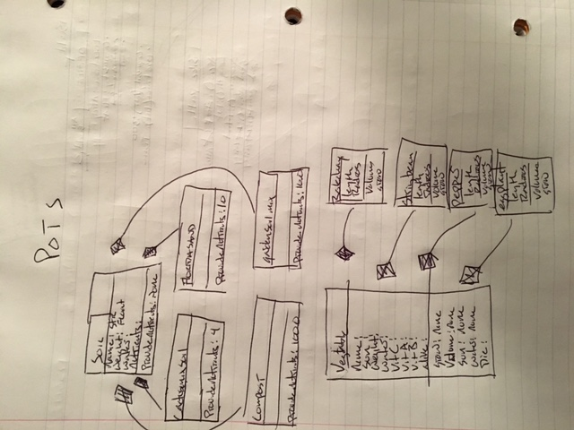

## Smart City (My Problem) Simulation

This is an attemp to show code converted to a diagram.  In this diagram you can see the soil class and vegtable class  taken from the code (POTS_system) files.

